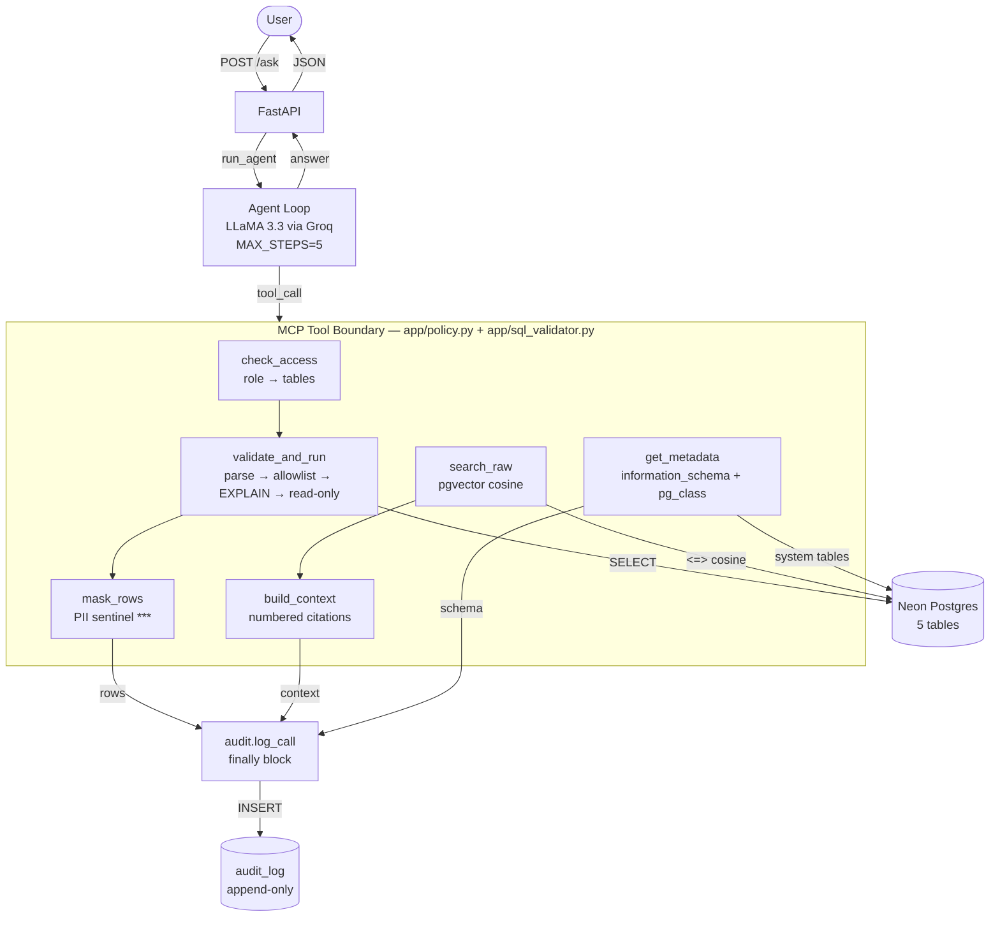

# PolicyMesh — Governed Data Intelligence

> Every query is SQL-validated, access-controlled by role, PII-masked, and audit-logged before a single row is returned. Governance lives at the MCP tool boundary — enforced in code, not in the prompt.

**[Live demo →](https://policymesh-5zv6.onrender.com)**

---

## What it does

PolicyMesh is a governed agentic data API. A user asks a natural-language question; an LLM agent decides which tool to call; every tool call passes a server-side enforcement pipeline before touching data.

```
User question
    │
    ▼
POST /ask  ──►  Agent loop (LLaMA 3.3 70B via Groq)
                    │
                    ▼ picks a tool
            ┌───────────────────────────────────────┐
            │         MCP Tool Boundary             │
            │                                       │
            │  query_sql   ──►  parse (SQLGlot)     │
            │                   allowlist check     │
            │                   RBAC check          │
            │                   EXPLAIN dry-run     │
            │                   read-only execute   │
            │                   PII mask            │
            │                   audit log  ─────────┼──► audit_log table
            │                                       │
            │  search_docs ──►  embed query         │
            │                   pgvector cosine     │
            │                   build_context [N]   │
            │                   audit log  ─────────┼──► audit_log table
            │                                       │
            │  lookup_metadata ► role-filtered      │
            │                   schema discovery    │
            │                   audit log  ─────────┼──► audit_log table
            └───────────────────────────────────────┘
                    │
                    ▼
            Grounded, cited answer
```

## System design



## Why this design

**Governance at the boundary, not the prompt.** Prompt rules can be jailbroken, ignored, or forgotten across model upgrades. Every access-control decision in PolicyMesh is enforced server-side in `app/policy.py` — the model never sees data it shouldn't.

**Four SQL guards, cheapest first.**
1. `parse()` — SQLGlot AST; must be exactly one SELECT. Rejects DDL/DML before any network call.
2. `check_allowlist()` — every `exp.Table` and `exp.Column` node must be in the schema allowlist. Includes scope-alias fix so `ORDER BY total_revenue` passes when `total_revenue` is a SELECT alias.
3. `dry_run()` — `EXPLAIN` against live DB catches type mismatches the AST walk misses.
4. `execute_readonly()` — `SET TRANSACTION READ ONLY` blocks data-modifying CTEs at the engine level.

**Why a custom agent loop, not LangChain/LangGraph.**
The loop is 80 lines with explicit termination conditions, state as a flat messages list, and a hard step cap. LangGraph adds ~400 lines of framework surface area, a new graph DSL to explain, and hides the termination logic inside abstractions. For a governed system, the control flow must be auditable — a `while True` is auditable; a graph runtime is not.

**Two eval axes** (per the CLAUDE.md spec):
- Tool-selection accuracy: **100%** (6/6, threshold 83%)
- Groundedness: **80%** (LLM-as-judge via Groq, threshold 80%)

## Tech stack

| Layer | Choice | Why |
|-------|--------|-----|
| API | FastAPI (async) | Non-blocking I/O for DB + embedding calls |
| LLM agent | LLaMA 3.3 70B (Groq) | Free tier, tool calling, OpenAI-compatible API |
| Embeddings | Gemini embedding-001 | Free tier, 3072-dim, strong semantic quality |
| Database | Neon (serverless Postgres) | pgvector built-in, free tier, matches local dev |
| Vector search | pgvector `<=>` cosine | Native Postgres, no separate vector DB needed |
| Tool protocol | MCP 2.0 (SSE transport) | Industry standard for AI tool exposure |
| SQL parsing | SQLGlot | Typed AST, handles aliases, CTEs, subqueries |
| Tests | pytest + pytest-asyncio | 43 unit/integration tests + 2-axis live eval |

## Running locally

```bash
# Clone and install
git clone https://github.com/deepakmeena61/policymesh
cd policymesh
python -m venv .venv && .venv/bin/pip install -r requirements.txt

# Configure (get free keys at neon.tech, console.groq.com, aistudio.google.com)
cp .env.example .env
# Fill in DATABASE_URL, GROQ_API_KEY, GOOGLE_API_KEY

# Seed database
.venv/bin/python -m app.seed          # 5 tables, 25 customers, 67 orders
.venv/bin/python -m app.seed_docs     # 6 knowledge-base documents with embeddings

# Start
.venv/bin/uvicorn app.main:app --port 8000 --reload
# Open http://localhost:8000
```

## Running tests

```bash
# Unit + integration tests (no API keys needed for unit tests)
.venv/bin/pytest tests/test_policy.py tests/test_sql_validator.py -v

# Audit integration tests (needs DATABASE_URL)
.venv/bin/pytest tests/test_audit.py -v

# Live evals (needs GROQ_API_KEY + GOOGLE_API_KEY)
.venv/bin/pytest tests/test_eval.py -v -m eval -s
```

## Project structure

```
app/
├── main.py          # FastAPI app — /ask, /explore, /audit, /health, env validation
├── agent.py         # Agent loop: tool selection, MAX_STEPS cap, messages state, LLM retry
├── mcp_server.py    # MCP 2.0 SSE server — 3 tools: query_sql, search_docs, lookup_metadata
├── policy.py        # ← ALL governance: ROLE_POLICY, check_access(), mask_rows(), ABAC sketch
├── sql_validator.py # 4-guard SQL pipeline + scope-alias fix for ORDER BY/HAVING/CTE aliases
├── audit.py         # Append-only audit log — log_call() context manager fires in finally
├── metadata.py      # Role-filtered schema discovery (information_schema + pg_class)
├── docs.py          # pgvector cosine search + build_context() with [N] citation markers
├── embed.py         # Google Gemini embedding wrapper (asyncio.to_thread, singleton client)
├── explore.py       # Data exploration API — same policy masking as MCP tools
├── seed.py          # 5 tables, 25 customers, 67 orders, 12k events, 28 tickets (--reset flag)
└── seed_docs.py     # 6 KB docs with Gemini embeddings (--reset flag)
tests/
├── test_policy.py        # 15 unit tests — RBAC + PII masking
├── test_sql_validator.py # 23 unit tests — 4 guards + scope-alias edge cases
├── test_audit.py         # 4 integration tests — hits real Neon DB
└── test_eval.py          # 2-axis eval: tool-selection accuracy + groundedness (LLM-as-judge)
```

## Demo scenarios

| Role | Query | What to observe |
|------|-------|-----------------|
| `analyst` | "Who are our top customers by spend?" | `email` shows `***` in MCP enforcement trace |
| `viewer` | "List all customers" | MCP boundary: `RBAC ✗ BLOCKED` |
| `analyst` | "What SLA do enterprise customers get?" | `search_docs` + `[1]` citations in answer |
| `admin` | "What data do I have access to?" | `lookup_metadata` returns full schema + row counts |
| `analyst` | "Open critical support tickets?" | `tickets.subject` shows `restricted` — PII policy |
| any | Click **Explore** tab | Role-filtered schema + sample rows + stats per column |
| any | Click **Audited** pill | Live feed of every tool call with role, latency, row count |

## Known limitations / production delta

| Gap | Current state | Production fix |
|-----|--------------|----------------|
| **Auth** | `caller_role` is a POST body param — any caller can claim any role | Extract role from verified JWT at FastAPI middleware; `policy.py` doesn't change |
| **ABAC** | RBAC only (role → tables/columns) | Extend to ABAC via a policy DB table with subject attributes + resource sensitivity tags — sketch in `policy.py` |
| **Alias PII bypass** | `SELECT email AS contact` renames the column, bypassing `mask_rows` | Column-level `GRANT` on a read-only Postgres role — the DB refuses the query regardless of aliasing |
| **Dynamic roles** | `ROLE_POLICY` is startup config | Move to DB-backed policy table; make `check_access()` async with short cache |
| **Data lineage** | Not tracked | Extend `audit_log` with a `lineage` JSONB column recording upstream table dependencies per query |
| **Warehouse scale** | Neon Postgres only | `search_raw()` in `docs.py` is the only pgvector call — swap for Databricks Vector Search / Pinecone without touching governance layer |
| **LLM provider** | Groq free tier (100k tokens/day) | Drop-in swap via `AGENT_MODEL` env var; governance is LLM-agnostic |

---

Built as a portfolio project demonstrating MCP, governed data access, agentic retrieval, and two-axis eval — the core skills for AI platform engineering on data-mesh infrastructure.
